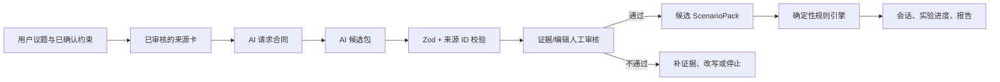

# AI 与规则引擎架构

维护任务：TASK-029  
状态：合同已冻结；真实 Provider 接入留给 TASK-030

## 一句话

AI 负责把“用户的问题 + 已审核来源”整理成**可审核候选**；规则引擎是唯一能够改变游戏会话、分数、实验进度和发布状态的地方。

这不是“AI 给用户算出哪条路更好”。AI 的可观察贡献是：把不同观点、个人约束和未知条件整理为来源可追溯的候选路线、关键假设和小实验。没有 AI 时，固定 Demo 仍然完整可玩，但无法把新议题和新证据整理成候选结构。

## 职责边界

| 层            | 必须负责                                                         | 明确不负责                                                 |
| ------------- | ---------------------------------------------------------------- | ---------------------------------------------------------- |
| 用户          | 输入议题、确认约束、判断来源是否适用、选择行动                   | 接受系统替自己决定                                         |
| 检索 / 内容层 | 提供审核前的来源卡、原文链接、作者、观点和适用条件               | 把社区经验当作当前用户的事实                               |
| AI            | 议题归一、观点归纳、关键假设、候选行动、实验建议和解释文本       | 预测结果、选最佳路线、伪造来源、发布正式内容、写入游戏状态 |
| 人工审核      | 判断来源相关性、表述风险、候选结构是否可发布                     | 绕过来源或规则直接改会话                                   |
| 规则引擎      | 合法跳转、状态计算、行动历史、实验日期与进度、分享脱敏、发布门禁 | 解释开放文本、补造外部事实                                 |

## 数据流与门禁

AI 只能到达“候选包”。`GameSession`、`StateVector`、`StateDelta`、实验完成状态、审核决定和正式 `ScenarioPack` 都不在 AI 输出合同中；候选包使用 `.strict()` Zod Schema 拒绝额外的状态写入字段。`parseAiCandidateBundle` 还会拒绝任何不在本次已审核检索集合中的来源 ID。

## 输入合同

类型与运行时校验位于 [`src/features/ai/contracts.ts`](../src/features/ai/contracts.ts)。AI Provider 在 TASK-030 必须只接收 `AiGenerationRequest`：

- `topic`：原始问题、语言、可选期限、用户**已确认**的约束；
- `evidence`：3–12 条可追溯来源的 ID、标题、作者、主张、条件、立场和 URL；
- `task`：议题理解、观点归纳、下一步候选或候选解释；
- 固定指令：只返回可审核候选，不预测、不推荐、不改写状态。

请求不包含 `GameSession`、密码、OAuth Secret、真实联系方式、精确收入、未脱敏笔记或任意客户端指令。

## 输出合同

成功结果必须是 `AiCandidateBundle`，并且始终带有：

- `provenance: "ai-generated-candidate"`；
- provider、model、promptVersion、生成时间；
- 规范化问题、范围、已确认约束和待补信息；
- 有 `sourceId`、用途、置信提示与不确定性说明的多观点归纳；
- 2–3 条候选路线、1–4 项关键假设、1–3 个可逆行动和一个实验建议；
- `review.status`，且只能是待证据审核、待编辑审核或阻止，不能由 AI 标为发布。

实验文案固定带“这是实验建议，不是已执行的事实”。候选解释固定带“不预测结果、不提供最佳路线、不替用户做决定”的边界。

### 溯源规则

1. AI 对外部事实或经验的每一项主张必须有至少一个 `AiCitation`。
2. 引用 ID 必须属于请求中已审核的来源集合；未知 ID 会被拒绝。
3. 用户自己确认的约束可被复述，但不得被扩写成人格、财务能力或心理状态判断。
4. 观点归纳必须同时显示置信度和适用边界；来源不足时输出失败，不用看似合理的叙事补全。

## 失败与降级状态

| 代码                    | 用户看到的处理                         | 是否重试 | 后续动作                      |
| ----------------------- | -------------------------------------- | -------- | ----------------------------- |
| `timeout`               | “生成超时，未保存任何候选内容。”       | 是       | 重试或回到确定性 Demo         |
| `cancelled`             | “本次生成已停止，未保存任何候选内容。” | 否       | 保留当前页面，不改变会话      |
| `rate-limited`          | “请求过于频繁，请稍后再试。”           | 是       | 等待后重试或使用演示缓存      |
| `provider-unavailable`  | “AI 服务暂不可用。”                    | 是       | 继续固定 Demo；不伪造生成结果 |
| `invalid-output`        | “生成结果没有通过结构校验。”           | 有限重试 | 记录诊断，失败后转人工审核    |
| `insufficient-evidence` | “现有来源不足，先补充可追溯资料。”     | 否       | 搜索/审核更多来源或停止       |
| `citation-conflict`     | “来源的条件冲突，不能直接合并成结论。” | 否       | 显示分歧，要求用户/编辑确认   |
| `sensitive-topic`       | “这个议题不适合用普通人生推演处理。”   | 否       | 停止，转专业支持或人工处理    |
| `policy-refusal`        | “无法按这个请求生成候选内容。”         | 否       | 说明边界，不生成替代结论      |

失败结果同样是结构化 `AiFailure`，含 `retryable`、用户提示、诊断和允许的 fallback：追问用户、人工审核、固定 Demo 或停止。失败不会创建、修改或完成游戏会话。

## 必须人工审核的内容

下列内容即使 Schema 合法，也不能直接成为正式 `ScenarioPack`：

- 新议题的世界线、行动、反事实叙事和七天实验；
- 新来源的真实性、相关性、出处与适用条件；
- 涉及股权、劳动合同、税务、投资、医疗、法律、心理危机或未成年人处境的文本；
- 任何可能被理解为职业结果保证、风险承受判断或具体专业建议的表述；
- 引用有冲突、资料不足、低置信度或用户约束未确认的候选。

审核通过后的内容还必须经过现有 `ScenarioSchema`、`OutcomeTemplatesSchema` 和证据发布门禁校验，才可由规则引擎加载。

## 演示缓存与 AI 候选的标记

| 内容           | 标记                       | 可否直接使用 | 说明                                                 |
| -------------- | -------------------------- | ------------ | ---------------------------------------------------- |
| 固定 Demo 内容 | `deterministic-demo-cache` | 可以         | 人工维护、版本化、可重复运行；不宣称由 AI 即时生成。 |
| AI 返回的候选  | `ai-generated-candidate`   | 不可以       | 必须通过来源 ID 校验和人工审核。                     |
| AI 失败结果    | `ai-failure`               | 不可以       | 只用于透明降级，不保存为内容或状态。                 |
| 审核发布内容   | `reviewed-scenario-pack`   | 可以         | 未来由内容审核流程产生，仍须通过规则 Schema。        |

## 与 TASK-028 的关系

TASK-028 的公开研究和代理走查指出：用户可能误读“任意议题”“七天实验”“雷达图”和“分岔回声”。因此本合同禁止 AI 给路线分数、成功率或预测，也把实验状态和所有数值留给确定性规则。真人研究尚未完成，任务 030–035 的优先级必须在收到真实会话后复查。

## 下一步

TASK-030 实现仅服务端的 Provider 网关：读取密钥、设置超时、调用模型、解析本合同、记录可观测元数据，并把失败映射为 `AiFailure`。它不得放宽此处的来源、审核或状态边界。
