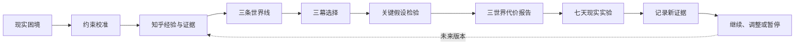

# 《人生分岔机》产品定义

版本：v1.0  
冻结日期：2026-09-07  
维护任务：TASK-027

## 一句话

《人生分岔机》是一款面向早期职业人群的决策演练产品：它把用户的现实困境和知乎上的多种真实经验整理成三条可比较的人生路线，帮用户找出最关键的未知，并设计一个可以先做、能退出的现实实验。

## 30 秒说明

用户面对“留下还是跳槽”“继续工作还是读研”这类高成本选择时，通常不缺利弊清单，缺的是三样东西：别人的经验怎样对应自己的处境、没走的路线会牺牲什么、现在能先验证哪件事。

《人生分岔机》让用户先填写自己的约束，再进入三条平行路线，在三幕选择中看到收益、代价和未解决的问题。系统不会给出最佳答案，也不会预测未来。它会挑出影响决定的关键假设，再把报告落到一个七天内可执行的现实实验。

## 第一目标用户

### 服务谁

20–32 岁、处于毕业后 0–8 年职业阶段的知识工作者。他们正在处理一个需要在未来 90 天内决定、至少有两个可行选项、做错后有明显时间或经济成本的职业问题，并且会主动到知乎搜索他人经验。

常见问题包括：

- 要不要离开稳定岗位去创业或加入初创团队；
- 留在当前公司还是接受另一份工作；
- 继续积累工作经验还是暂停工作读研；
- 留在大城市还是回到家乡发展。

### 他们已经试过什么

- 在知乎搜索相似经历，收藏几篇观点相反的回答；
- 问朋友、家人或前同事，但每个人站在不同利益和经验上；
- 做利弊表，列完以后仍然无法比较风险；
- 一直拖延，直到 offer、报名或离职期限逼近。

### 第一版本暂不重点服务

- 需要专业诊断或资质意见的医疗、法律、投资决定；
- 只有一个现实可行选项的问题；
- 只需要查询客观事实、不涉及价值取舍的问题；
- 处于即时危机、需要紧急援助的用户；
- 希望系统替自己承担决定或给出保证结果的用户。

## 核心用户任务

> 当我面对一个代价较高、又不能直接试错的职业选择时，我想把别人的经验放回自己的条件里，提前看见不同路线要付出的代价，找出真正需要核实的事，再用一个小实验决定是否继续投入。

用户进入时通常只有一句模糊的问题。离开时应至少带走四样东西：

1. 一条当前更愿意继续探索的路线，但不是系统推荐答案；
2. 另外两条路线的主要机会成本；
3. 一个会显著改变选择的关键未知；
4. 一个有时间、预算、证据和退出条件的下一步实验。

## 产品承诺

- 把“我到底该选哪个”改写成“我还缺哪条信息”。
- 把别人的结论还原为有适用条件的经验，不用多数票替用户做决定。
- 让用户看见未选择路线的代价，不把故事写成单一路线的自我合理化。
- 把一次大决定拆成可以撤回的小行动。

## 不做出的承诺

- 不预测用户几年后会怎样。
- 不计算伪精确成功率，不展示“最优选择”。
- 不把 AI 生成文本当成事实。
- 不保证七天实验能消除所有不确定性。
- 不自动代表用户向知乎或其他平台发布内容。

## 产品闭环

这个闭环里，故事负责让代价可感知，证据负责约束故事，实验负责把体验带回现实。报告不是结局，只是现实验证的起点。

## AI、知乎内容与规则引擎各自负责什么

| 部分     | 负责                                                     | 不负责                                     |
| -------- | -------------------------------------------------------- | ------------------------------------------ |
| 知乎内容 | 提供不同处境、选择结果、论证和反思的真实来源             | 不直接代表当前用户的答案                   |
| AI       | 理解议题、归纳观点差异、生成候选场景与针对性追问         | 不修改确定性状态，不伪造来源，不替用户决定 |
| 规则引擎 | 保存约束、执行状态变化、控制合法流程、计算报告和实验进度 | 不假装理解开放文本，不生成事实             |
| 用户     | 确认自己的约束、判断证据是否适用、选择现实行动           | 不需要接受系统给出的路线                   |

当前 Demo 的 AI 能力尚未真正接入，运行时主要依赖审核模板和确定性规则。真实 AI 链路将在 TASK-029–035 中实现，并继续保留离线降级。

## 当前黄金路径

1. 用户选择固定困境或进入个人校准。
2. 用户填写现金缓冲、共同承担者、担忧、目标和决策方式。
3. 用户选择留守、全押或搭桥中的一条世界线。
4. 用户完成三幕选择，并查看未选择世界在同一时刻的回声。
5. 用户选择一个关键假设，再根据线索标记支持、冲突或暂不清楚。
6. 系统根据完整历史生成三世界代价报告。
7. 系统选择与路线和证据状态匹配的七天实验。
8. 用户记录现实反馈，最后决定继续、调整或暂停。

## 第一版产品判断

如果用户只是觉得故事好看，但没有发现新的关键未知，产品没有完成任务。

如果用户能复述“我现在最需要核实的是哪件事”，并愿意保存或开始一个现实实验，说明推演产生了实际价值。北极星指标和配套护栏见 [`METRICS.md`](METRICS.md)。

## 范围决定

- 第一阶段只聚焦职业与升学相关选择，不同时扩展关系、医疗和投资主题。
- 先做第二个完整场景，再宣称支持任意议题。
- 真实用户证据优先于新增视觉功能。
- AI 接入必须能通过隐藏输入、来源忠实和失败降级测试。
- OAuth、云端同步和多人协作晚于真实 AI 与第二场景。

## 相关文档

- 当前用户旅程：[`USER-JOURNEY.md`](USER-JOURNEY.md)
- 指标字典：[`METRICS.md`](METRICS.md)
- 长期路线：[`PRODUCT-ROADMAP.md`](PRODUCT-ROADMAP.md)
- 系统架构：[`ARCHITECTURE.md`](ARCHITECTURE.md)
