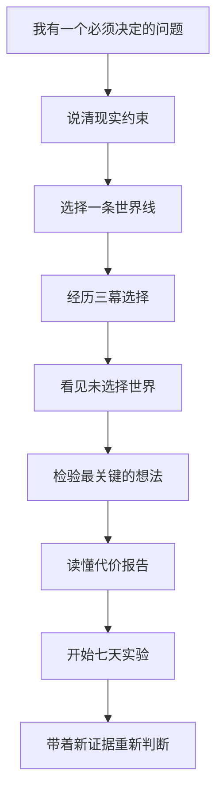

# 当前用户旅程

版本：v1.0  
维护任务：TASK-027

## 旅程总览

## 分阶段说明

| 阶段       | 用户脑中的问题                   | 用户输入                                   | 产品输出                         | 用户得到的价值             | 主要风险                                 | 观察指标                           |
| ---------- | -------------------------------- | ------------------------------------------ | -------------------------------- | -------------------------- | ---------------------------------------- | ---------------------------------- |
| 触发       | “这件事我到底怎么选？”           | 一句困境或固定场景                         | 产品边界与体验入口               | 知道这里不会替自己算命     | 首屏解释太多，用户不知道先点哪里         | 启动率、首次操作时间               |
| 校准       | “我的情况和别人不一样。”         | 现金缓冲、共同承担者、担忧、目标和决策方式 | 本局约束向量                     | 自己的条件会真实影响后续   | 像人格测试；用户不理解数值用途           | 校准完成率、单题停留时间           |
| 选世界     | “我想先看看哪条路？”             | 留守、全押或搭桥                           | 主世界和另外两条对照世界         | 把抽象方案变成可进入路线   | 路线看起来有明显正确答案                 | 路线分布、返回率                   |
| 三幕推演   | “选了以后会遇到什么？”           | 三次关键行动                               | 即时结果、延迟代价和状态变化     | 感受到收益与代价同时发生   | 文案太长；选择只是换台词                 | 每幕完成率、选项分布               |
| 分岔回声   | “没走的路呢？”                   | 查看其他世界                               | 同时刻的反事实切片               | 看见机会成本               | 被误解为未来预测                         | 回声打开率、理解访谈               |
| 想法检验   | “我最相信的事是真的吗？”         | 一个假设和一条线索                         | 支持、冲突或暂不清楚             | 把判断从感觉变成待核实事实 | 系统强行反转；三种状态难懂               | 假设选择率、结果理解率             |
| 代价报告   | “前面的选择合在一起意味着什么？” | 完整会话历史                               | 三世界对比、得到/失去/未知和盲点 | 能说出当前路线的代价与缺口 | 信息密度过高；雷达图像评分               | 报告到达率、关键未知复述率         |
| 七天实验   | “我现在能做什么？”               | 时间、预算、每日记录和反馈                 | 与路线匹配的小实验               | 用较低成本获得新信息       | 被当成形式化清单；快速演示与真实实验混淆 | 实验启动率、首日完成率、七日完成率 |
| 分享与复盘 | “怎样和队友或家人解释？”         | 分享选择或后续反馈                         | 脱敏摘要和下一步                 | 对话围绕证据而不是立场争论 | 隐私泄露；分享卡缺少上下文               | 复制率、复盘回访率                 |

## 当前最需要验证的五个问题

1. 用户是否愿意在做决定前花 5–10 分钟完成一次推演？
2. 用户能否理解“分岔回声是情景对照，不是预测”？
3. 想法检验能否找到用户真正关心的未知，而不是系统自说自话？
4. 报告是否帮助用户缩小问题，还是只增加信息量？
5. 七天实验是否足够具体，让用户第二天真的愿意执行？

这些问题直接构成 TASK-028 的访谈与无讲解测试重点。
